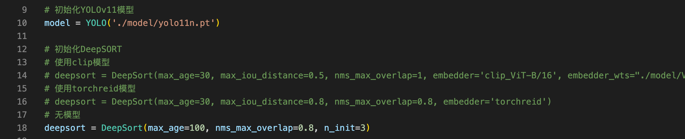

# metro-station-passenger-detection

### 介绍

基于yolo检测算法和deep_sort_oh跟踪算法的地铁站乘客检测任务。

deep_sort_oh算法是在deep_sort_realtime的基础上采用sort_oh算法的思想进行优化而得，对于遮挡情况进行了优化。

### 项目结构

run.py：程序运行入口



检测模型提供了yolov8n和yolov11n，可直接替换

跟踪模型提供了clip_ViT-B/16和osnet_ain_x1_0，deep部分的跟踪能力主要来源于预训练的神经网络

deep_sort_oh文件夹：在deep_sort_realtime基础上修改形成的deep_sort_oh

deep_sort_oh/deepsort_tracker.py：DeepSort模型实现

deep_sort_oh/deep_sort/detection.py：检测框detection类实现

deep_sort_oh/deep_sort/tracker.py：Tracker类实现（装载Track类）

deep_sort_oh/deep_sort/track.py：跟踪框Track类实现

deep_sort_oh/deep_sort/linear_assignment.py：Track和detection匹配的具体算法实现

deep_sort_oh/deep_sort/iou_matching.py：sort_oh思想改进后的iou计算逻辑实现

embedder文件夹：deepsort模型载入神经网络

utils文件夹：包含nms非极大值抑制方法的实现

### 运行
测试视频和模型权重可以在[这里]([https://markdown.com.cn "最好的markdown教程"](https://drive.google.com/drive/folders/1rgbXHBIE_35pof4PlErOeAIr6zXwgCh-))下载

```python
pip install -r requirements.txt
python run.py
```

注意run.py模型部分和视频名部分按需修改

### 结果


### 参考

deep_sort_realtime源码：https://github.com/levan92/deep_sort_realtime/tree/master

model_zoo：https://kaiyangzhou.github.io/deep-person-reid/MODEL_ZOO

sort_oh源码：https://github.com/mhnasseri/sort_oh?tab=readme-ov-file

sort_oh介绍：https://blog.csdn.net/qq_49560248/article/details/135218024

sort_oh文献：https://arxiv.org/abs/2103.04147

clip_ViT-B/16模型下载地址：https://openaipublic.azureedge.net/clip/models/5806e77cd80f8b59890b7e101eabd078d9fb84e6937f9e85e4ecb61988df416f/ViT-B-16.pt

测试视频下载地址：https://aistudio.baidu.com/datasetdetail/51453
